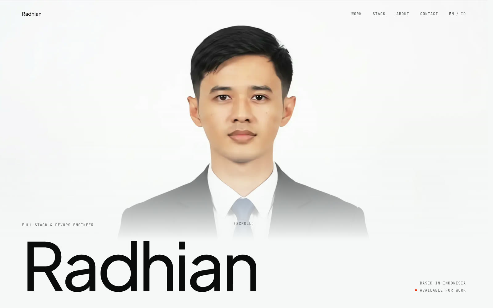
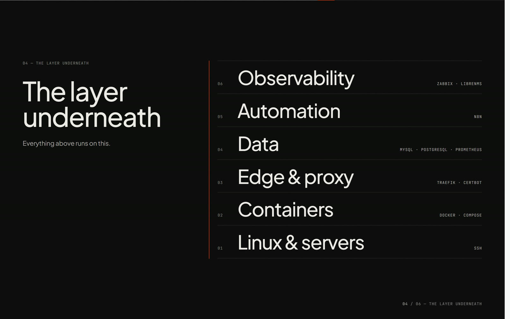
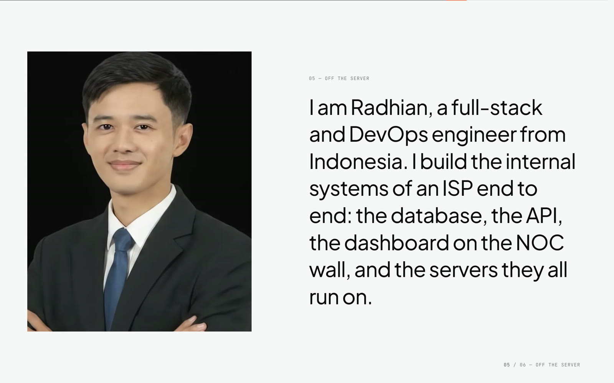
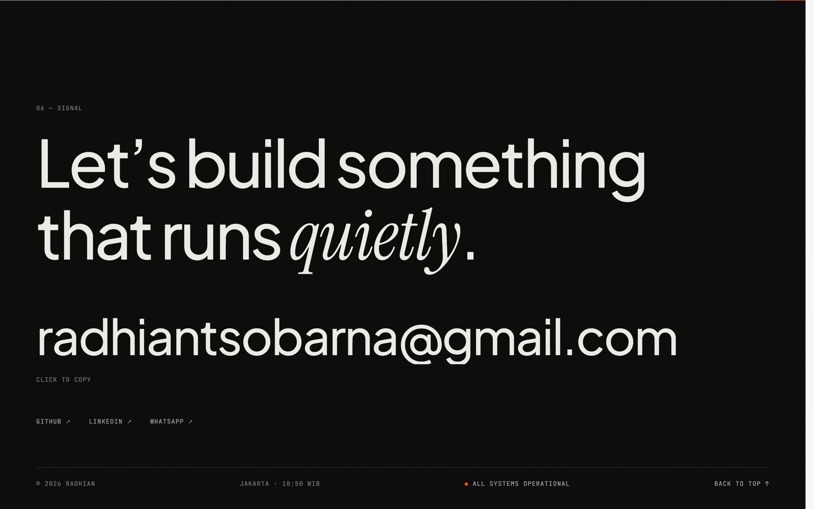
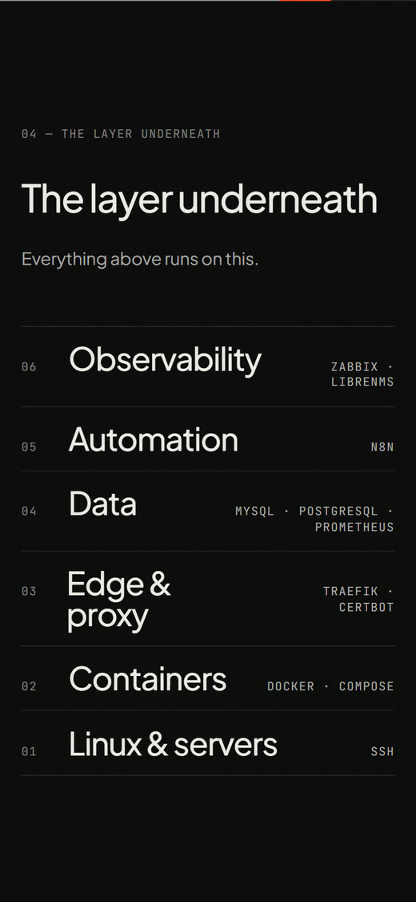
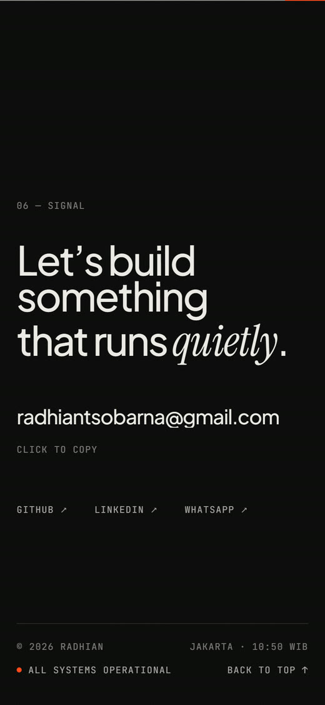

## Radhian Sobarna — Full-stack & DevOps engineer

I build the quiet systems an ISP runs on: monitoring, inventory, finance, sign-on and fiber network maps.
Seventeen of them are running in production, from the database and the API to the dashboard on the NOC wall and the servers underneath.

---

### A look inside

<table>
  <tr>
    <td width="50%"></td>
    <td width="50%"></td>
  </tr>
  <tr>
    <td width="50%"></td>
    <td width="50%"></td>
  </tr>
</table>

<table>
  <tr>
    <td width="25%"></td>
    <td width="25%"></td>
    <td width="25%"></td>
    <td width="25%"></td>
  </tr>
</table>

---

### What I work with

**Build:** Next.js · React · NestJS · Laravel · Go · Node.js · Tailwind CSS 
**Data:** MySQL · PostgreSQL · Prometheus · Redis 
**Run:** Docker · Traefik · Linux · Zabbix · LibreNMS · n8n

### Let's connect

[radhian.my.id](https://radhian.my.id) · [LinkedIn](https://www.linkedin.com/in/radhian-sobarna-a150192a8) · [radhiantsobarna@gmail.com](mailto:radhiantsobarna@gmail.com)
